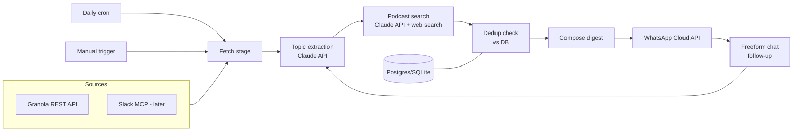

# AI/ML Podcast Recommender — Implementation Plan

2026-09-21 · @Arne

## Goal & scope

A personal service that turns your Granola meetings (and eventually your company's #tech-share Slack channel) into a daily podcast digest, delivered on WhatsApp, plus an on-demand chat (by text or the user actually speaks) for topic recommendations — so commute time on the train/car can be spent listening to something relevant instead of scrolling for it.

**v1 scope**

- Source: Granola meeting notes only
- Output: daily WhatsApp digest + freeform chat follow-up
- Manual trigger alongside the daily cron

**Planned next**

- Slack #tech-share channel as a second source
- Newsletters, arXiv, starred GitHub repos as further sources, using the same connector interface

## Architecture overview

One Python (FastAPI) service owns all of this. The cron and the manual trigger both call the same fetch → extract → search → dedup → send pipeline; only the trigger differs.

## Connector registry pattern

Every source implements one interface: `get_recent_items(source_name: str) -> list[dict]`. The rest of the pipeline (topic extraction, digest generation) only ever calls this interface — it doesn't know or care whether a given source is REST or MCP underneath.

**Decision rule for a new source:**

| Source offers | Use | Why |
| --- | --- | --- |
| A personal API key | Direct REST call | No OAuth flow to build or refresh; a plain HTTP request |
| Only OAuth (no personal key) | MCP via the Anthropic API's `mcp_servers` param | The OAuth handshake and token handling is unavoidable either way — let Claude drive the tool call instead of reimplementing it |

Granola offers a personal API key → REST. Slack is OAuth-only → MCP. This keeps the codebase consistent (one interface) without forcing OAuth complexity onto sources that don't need it.

## Source implementations

| Source | Method | Auth | Notes |
| --- | --- | --- | --- |
| Granola | REST (`GET /v0/notes`, `GET /v0/notes/{id}`) | Personal API key, generated in the Granola desktop app | Requires a Business or Enterprise Granola plan — confirm before building |
| Slack (#tech-share) | MCP via `mcp_servers` | OAuth token from installing a Slack app scoped to that one channel | Store the token server-side; check whether workspace admin approval is needed to install a bot |
| Future: arXiv | REST, no auth | — | Public API |
| Future: GitHub starred repos | REST | Personal access token | — |
| Future: newsletters | TBD (RSS or forwarded email) | — | Decide once prioritized |

## Pipeline stages

1. **Fetch** — call `get_recent_items()` for each configured source; returns raw notes/messages from the last 24h (or since last run).
2. **Topic extraction** — one Claude API call reads the fetched items and pulls out the AI/ML topics that actually came up, not a generic summary.
3. **Podcast search** — a Claude API call with web search enabled, given the extracted topics, finds genuinely recent episodes covering them (name, podcast, why it's relevant).
4. **Dedup** — check candidate episodes against the `sent_episodes` table; drop anything already sent.
5. **Compose digest** — format the surviving episodes into a short WhatsApp message.
6. **Send** — push via WhatsApp Cloud API; log what was sent.

## Delivery: WhatsApp

Using Meta's WhatsApp Cloud API directly (free, no Twilio needed).

- **Setup**: a free Meta test number, which can message your own phone with no business verification needed for personal use.
- **Daily push**: since the bot is speaking first (outside any user-initiated session), the first message of the day must be a pre-approved **template message** (e.g. "Your AI podcast digest is ready 🎧"). Approval is a one-time, few-minute step per template.
- **Full digest**: sent as a normal freeform message right after the template — this opens a 24h customer-service window during which the bot can message freely.
- **Chat follow-up**: any reply from you within that window (or that reopens it) is handled as freeform chat, answered via the Claude API using recent topic history as context.

## Data model

| Table | Key fields | Purpose |
| --- | --- | --- |
| `topics` | id, text, source, first\_seen, last\_seen | Running history of ML/AI topics extracted from sources, to spot recurring interests over time |
| `sent_episodes` | id, title, podcast, url, published\_date, sent\_date, matched\_topic | Dedup — never recommend the same episode twice |
| `fetch_log` | id, source, run\_at, item\_count | Debugging/observability for the daily job |
| `chat_messages` (optional, v1.5) | id, direction, body, sent\_at | Context for freeform chat follow-up |

## Scheduling & manual trigger

- **Cron**: a scheduled job on the hosting platform (Railway/Fly.io/Render all have built-in cron) runs the full pipeline once daily, timed to land before your commute.
- **Manual trigger**: the same pipeline function exposed as (a) a WhatsApp command like `/digest`, and/or (b) a small authenticated HTTP endpoint you can hit yourself. Both call the identical fetch → extract → search → dedup → send function the cron uses — no separate code path to maintain.

## Open questions to verify

- [ ] Is the Granola workspace on a Business/Enterprise plan? (Required for API key access; Basic only gets MCP.)
- [ ] Does installing a Slack bot for #tech-share need workspace admin approval at your company?
- [ ] Confirm WhatsApp Cloud API test-number limits are sufficient for daily personal use (no business verification needed at that scale).
- [ ] Decide the actual podcast-discovery method: Claude API + web search (simplest, no extra account) vs. a dedicated podcast search API like Listen Notes (more structured episode data, needs its own API key).

## Suggested build order

| Milestone | Delivers | Depends on |
| --- | --- | --- |
| 1. Connector registry + Granola | `get_recent_items("granola")` returns real notes | Granola API key |
| 2. Topic extraction | Claude call turns fetched notes into a topic list, printed to console | Milestone 1 |
| 3. Podcast search + digest text | Candidate episodes found and formatted, printed to console | Milestone 2 |
| 4. WhatsApp send (manual) | One digest successfully delivered to your phone | Meta test number + template approval |
| 5. Dedup + storage | Repeated runs don't repeat episodes | Milestones 3–4 |
| 6. Scheduler + manual trigger | Daily cron live, plus on-demand refresh | Milestone 5 |
| 7. Chat follow-up | Freeform WhatsApp replies answered via Claude | Milestone 4 |
| 8. Slack connector | `get_recent_items("slack")` added, topics blend both sources | Slack app approved; registry from Milestone 1 |

Each row is a natural ticket boundary; 1–6 form a working v1, 7–8 are the first extensions.
